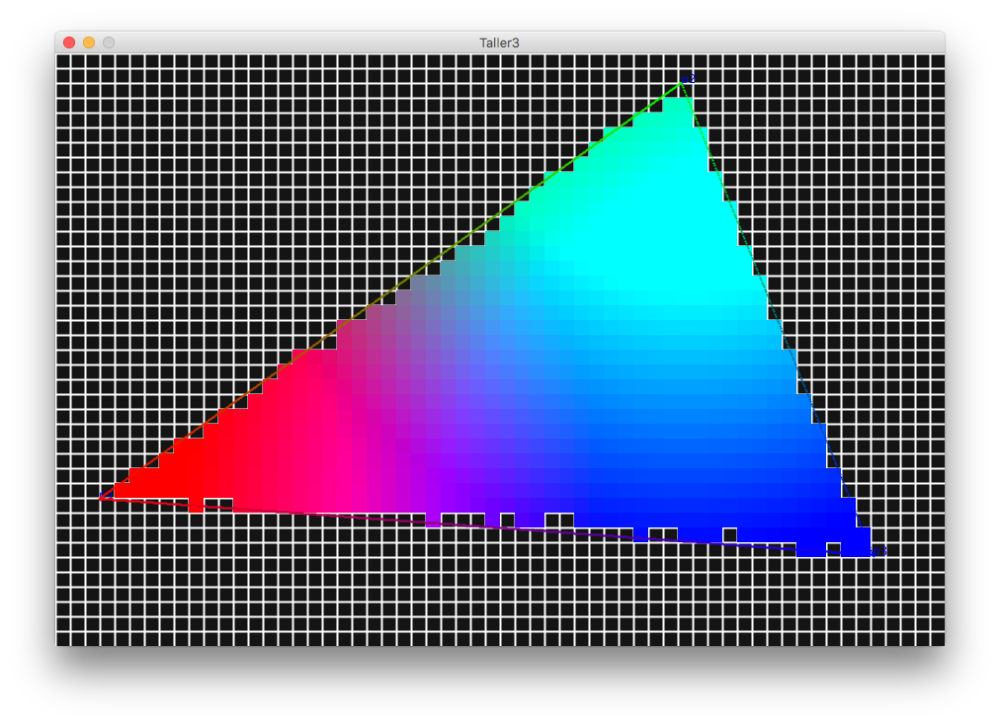
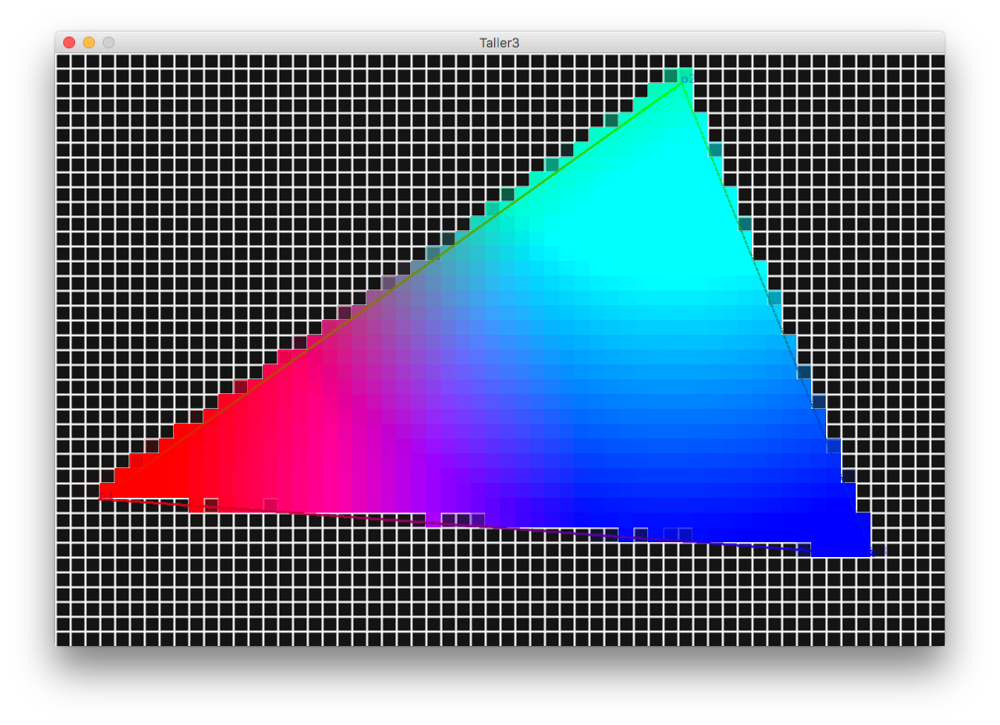

# Taller raster

## Propósito

Comprender algunos aspectos fundamentales del paradigma de rasterización.

## Tareas

Emplee coordenadas baricéntricas para:

1. Rasterizar un triángulo.
2. Sombrear su superficie a partir de los colores de sus vértices.
3. Implementar un [algoritmo de anti-aliasing](https://www.scratchapixel.com/lessons/3d-basic-rendering/rasterization-practical-implementation/rasterization-practical-implementation) para sus aristas.

Referencias:

* [The barycentric conspiracy](https://fgiesen.wordpress.com/2013/02/06/the-barycentric-conspirac/)
* [Rasterization stage](https://www.scratchapixel.com/lessons/3d-basic-rendering/rasterization-practical-implementation/rasterization-stage)

Implemente la función ```triangleRaster()``` del sketch adjunto para tal efecto, requiere la librería [nub](https://github.com/visualcomputing/nub/releases) (versión >= 0.2).

## Integrantes

Complete la tabla:

| Integrante | github nick |
|------------|-------------|
|        Nicolás Viveros    |        viversba     |
|        Juan Felipe Cárdenas    |        Jufcardenasmo     |

## Discusión

Al rasterizar el triángulo, se obtuvo que la función __EdgeFunction()__ descrita en el documento [Rasterization stage](https://www.scratchapixel.com/lessons/3d-basic-rendering/rasterization-practical-implementation/rasterization-stage) es un buen método para calcular el valor de un pixel individual, sin embargo, es necesario implementar anti-aliasing para que las figuras se vean más realistas.

Para implementar el anti-aliasing, se usó la técnica mencionada en el documento  [Rasterization Practical Implementation](https://www.scratchapixel.com/lessons/3d-basic-rendering/rasterization-practical-implementation/rasterization-practical-implementation), en el cual simplemente se sugiere una subdivisión virtual de los pixeles individuales, de manera que se compute la función __EdgeFunction()__ para cada una de esas subdivisiones y se pueda encontrar el número de subdivisiones que están dentro de la figura. Luego, se divide el número de subdivisiones que están dentro de la figura sobre el número de subdivisiones totales que se hicieron. Con este número, se produce una sombra del color, que será asignada a dicho pixel, haciendo que los bordes de la figura no se vean tan pronunciados.


_Triángulo SIN anti-aliasing_


_Triángulo CON anti-aliasing_

## Entrega

* Plazo: ~~20/10/19~~ 27/10/19 a las 24h.